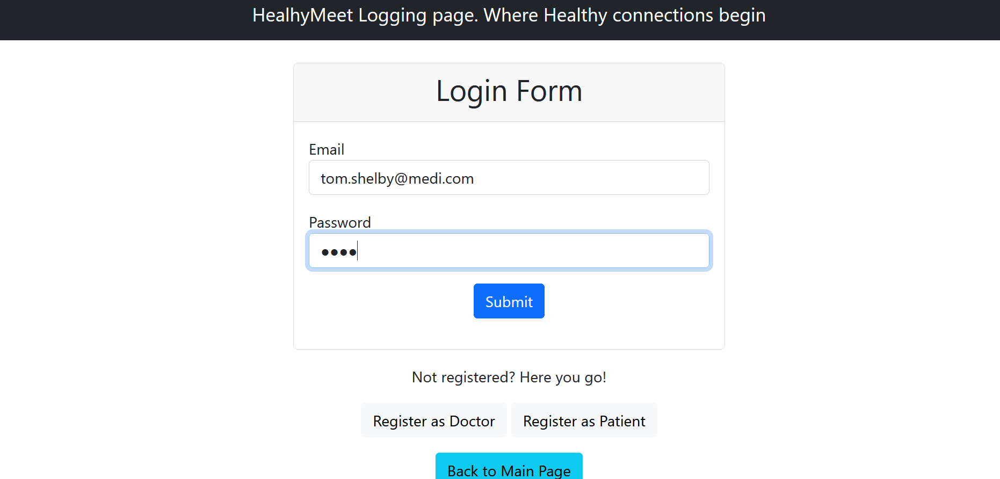
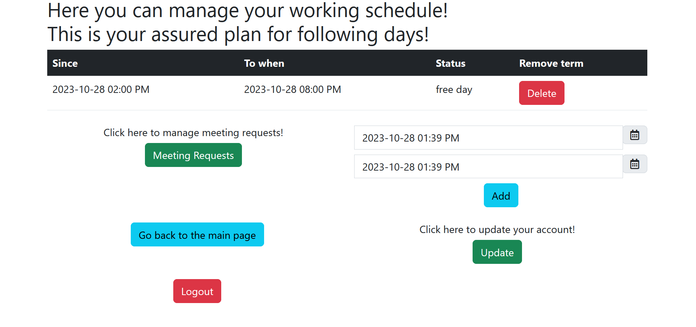
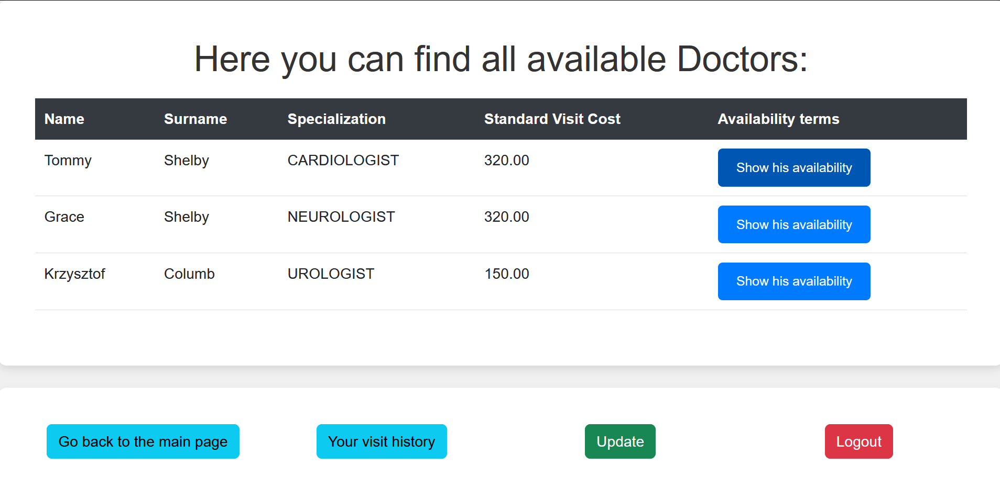
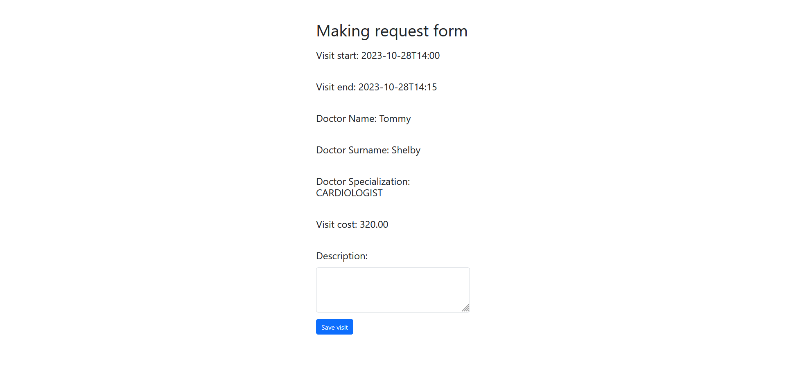
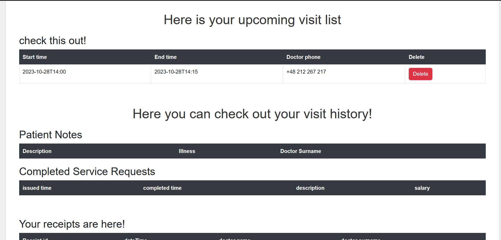
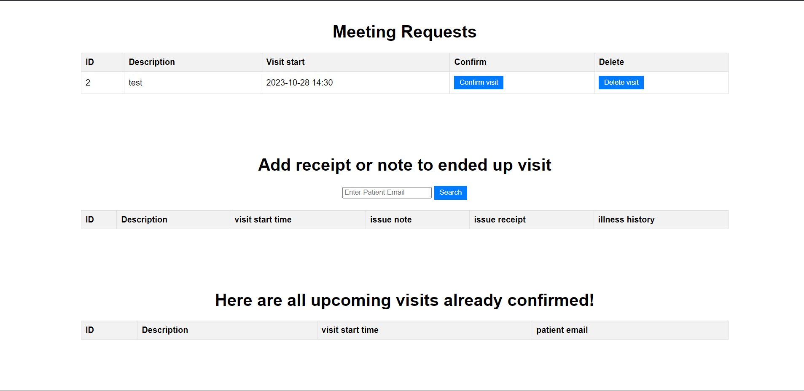
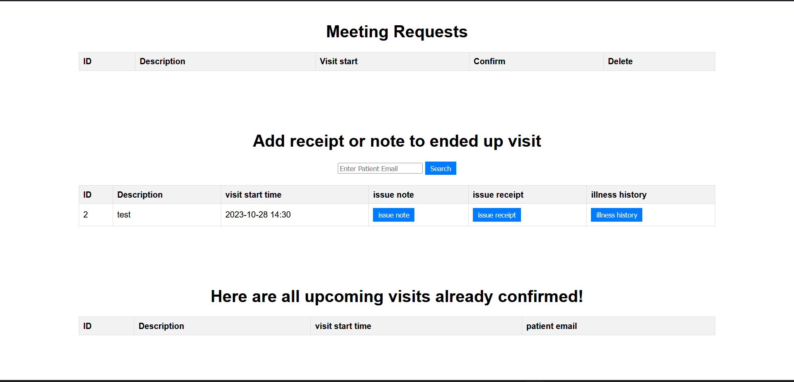
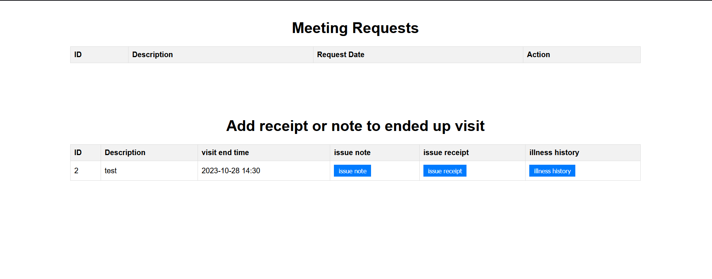
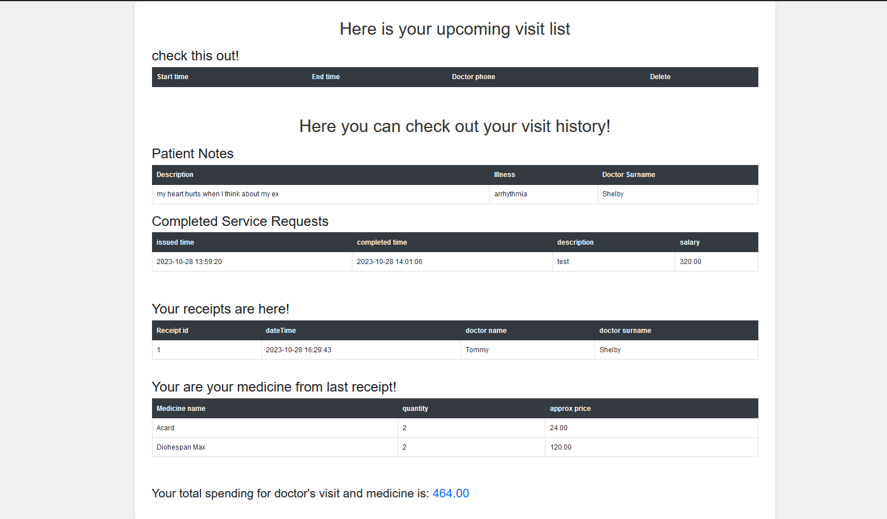

# HealthMeet Medical Application Project

## Project Description

HealthMeet is a Java-based medical application project that utilizes two main architectural patterns: Spring Web MVC and REST API.

## Application Features

The application offers a variety of features that make it easy for both patients and doctors to use the system. Here are the main functions available to both user groups:

### Doctors

- **Availability**: Doctors can specify their availability for potential appointments, allowing patients to schedule appointments at chosen times.
- **Registration**: New doctors need to register in the application to start using its services.
- **Medical Notes**: After a patient visit, a doctor can enter medical notes that are stored in the system.
- **Medical History**: Doctors have access to a patient's medical history, making diagnosis and treatment easier.
- **Prescriptions**: Doctors can issue prescriptions and assign medications for a given visit. They enter the quantity of medications, their total cost, and update patient information. Doctors can also update their profiles.

### Patients

- **Appointment Booking**: Patients can schedule appointments with selected doctors during available time slots. The application handles cases where two patients try to book the same slot with the same doctor.
- **Registration**: New patients also need to register to use the application.
- **Visit History**: Patients can check the history of past visits and upcoming appointments.
- **Appointment Cancellation**: Patients have the option to cancel previously scheduled appointments.
- **Medical Notes**: Patients can review medical notes written by doctors for past visits.
- **Prescriptions**: Doctors can issue prescriptions and assign medications for a given visit. Patients enter the quantity of medications and their total cost. Patients can also update their profiles.

## Default Users

To facilitate application testing, default users are provided:

### Doctors

1. Email: tom.shelby@medi.com, Password: test
2. Email: grace.shelby@medi.com, Password: test
3. Email: krzysztof.cool@medi.com, Password: test

### Patients

1. Email: w.white@gmail.com, Password: test
2. Email: s.white@gmail.com, Password: test
3. Email: j.pinkman@wp.pl, Password: test

To get into open API documentation you have to log in with following data:
 Email: rest_api@wp.pl, Password: test

You can open swagger-ui with this endpoint: http://localhost:8190/HealthMeet/swagger-ui/index.html
## Technical Aspects

Tests are run using **testContainers**. Docker must be installed and running on your operating system.
You can open your app in containers, enter
```bash
   docker compose up
   ```

### Testing

As part of the project, various types of tests have been conducted, including:

- **Unit Test**: Tests that focus on isolating and testing individual components of the system, such as service and controller methods.
- **Parametrized Tests**: Tests with different parameter sets. We test the validation process in our application.
- **WebMvcTest**: Tests for the Spring MVC controller layer.
- **RestAssured Tests**: REST API tests using the RestAssured library.
- **Data JPA Tests**: Integration tests with the database using Spring Data JPA.
- **Spring Boot Application Test**: Tests for the entire Spring Boot application.


### Database Migrations

To initialize tables and data in the database, we use Flyway migrations. Migrations allow us to manage the database schema and evolve its structure.
### Security lawyer
Certainly, here's a concise summary of the "Security Lawyer" security layer in your application:

### Security Layer 

The security layer in the "Security Lawyer" application utilizes bcrypt encryption for password storage and relies on Spring Security for authentication and authorization.

1. **Password Encryption**: User passwords are securely encrypted using the bcrypt algorithm, ensuring that they are well-protected even in the event of a data breach.

2. **Spring Security**: Spring Security is employed to manage user authentication and authorization. It enables the configuration of access rules based on user roles and permissions, safeguarding access to critical resources.

3. **Resource Protection**: The security layer safeguards access to key application resources and functions, such as login, user data updates, the homepage, and more. Access is controlled based on user roles and permissions.

4. **Session Management**: Spring Security handles session management, ensuring that users are authenticated throughout their interactions with the application. Sessions are secured and restricted to authorized users.

5. **Configured Security**: The "Security Lawyer" application is configured to provide comprehensive data and privacy protection. It includes safeguards against SQL Injection, Cross-Site Scripting (XSS), and Cross-Site Request Forgery (CSRF) attacks. Session management and password resets are implemented securely.

## Installation Instructions

1. Clone the repository to your local computer:

   ```bash
   git clone https://github.com/centGeek/HealthMeetProject
   ```

2. Navigate to the project directory:

   ```bash
   cd PathToThisProject
   ```

3. If you want, configure database access and other settings in the `application.properties` file.

4. Run the application by running  `HealthyMeetApplication.java` file, and then visit the website at `http://localhost:8190/HealthMeet` by default.

## Application Operation
1. During user registration, make sure to validate the provided data. The input arguments must follow these patterns:
   **Phone** -> **+xx xxx xxx xxx**, where spaces are required, and the field must be unique.
   **Email** -> Must have the structure of an email, although it doesn't need to be an actual email address.
   **Nickname** -> Minimum of **5** characters in length.

2. During login, use your **email** and **password**.
   Here is a formatted and more readable description of the step-by-step testing process for the "web-wvc" web application:

### Step-by-Step Testing of spring web-mvc  Application

During login, use your **email** and **password**.

#### Key Steps Presented Below:
   Points **1-5** are not presented here
1. **Account Registration**: You can register a new user account.

2. **Account Update**: You can update your account details.

3. **Home Page**: Review the application's homepage.

4. **"About Us" Page**: Explore the "About Us" page with information about the application.

5. **Swagger-UI**: Utilize the Swagger-UI documentation.

#### Logging in as a Doctor:

6. On the main page, click "Log in as a doctor."

7. Enter your login credentials.

   

8. Input the doctor's availability at a selected time. You can choose date graphically. Time has to be chosen manually 

   

9. Log out, return to the main page, and log in as a patient.

#### Logging in as a Patient:

10. After logging in, check the availability of Tommy Shelby.



11. After selecting availability, enter the purpose of your meeting request and save the visit.



12. Go to the Patient History section. There, you will find information about your visit request.



13. You can delete a meeting request.

14. Log out and log in as Tommy Shelby.

#### Logging in as Tommy Shelby:

15. Go to the "Meeting Requests" section. You can confirm or delete meeting requests. Without confirmation, the visit will not commence.



16. In the "Here are upcoming visit confirmed" section, you can find upcoming confirmed meeting requests.

17. Once the visit time is over, you can write a note, issue a receipt, or view the patient's illness history.Note and receipt can be set only one to particular visit. Methods are tested and work correctly

18. Additionally when there is a lot of ended up visits, you can filter patients using email

19. In the patient's visit history, we have information about prescriptions, medications from the last prescription, and the average estimated cost of those medications. We also have an approximate amount we've spent on treatment since using the application.

#### Contact

If you are interested in my project, feel free to reach out to me via email: [centkowski.lukasz03@gmail.com].