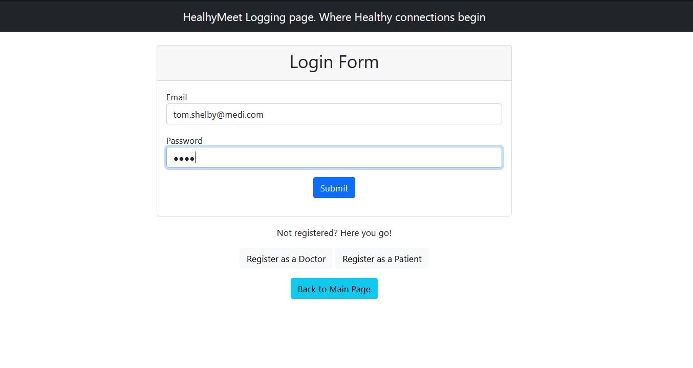
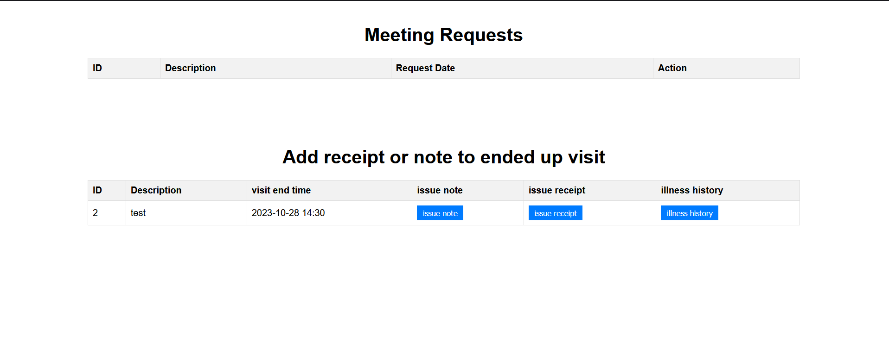

# Projekt Aplikacji Medycznej HealthMeet

## Opis Projektu

HealthMeet to projekt aplikacji medycznej oparty na języku Java, który wykorzystuje dwa główne wzorce architektoniczne:
Spring Web MVC i REST API.

## Funkcje Aplikacji

Aplikacja oferuje różnorodne funkcje, które ułatwiają zarówno pacjentom, jak i lekarzom korzystanie z systemu. Oto
główne funkcje dostępne dla obu grup użytkowników:

### Lekarze

- **Dostępność**: Lekarze mogą określić swoją dostępność do potencjalnych wizyt, pozwalając pacjentom umawiać się na
  wizyty w wybranych godzinach.
- **Rejestracja**: Nowi lekarze muszą zarejestrować się w aplikacji, aby rozpocząć korzystanie z jej usług.
- **Notatki Medyczne**: Po wizycie pacjenta, lekarz może wprowadzać notatki medyczne przechowywane w systemie.
- **Historia Medyczna**: Lekarze mają dostęp do historii medycznej pacjenta, co ułatwia diagnozowanie i leczenie.
- **Recepty**: Lekarze mogą wystawiać recepty i przypisywać leki na wizytę. Wprowadzają ilość leków, ich całkowity koszt
  i aktualizują informacje pacjenta. Lekarze mogą także aktualizować swoje profile.

### Pacjenci

- **Rezerwacja Wizyt**: Pacjenci mogą umawiać się na wizyty u wybranych lekarzy w dostępnych slotach czasowych.
  Aplikacja obsługuje przypadki, w których dwóch pacjentów próbuje zarezerwować ten sam slot u tego samego lekarza.
- **Rejestracja**: Nowi pacjenci także muszą się zarejestrować, aby korzystać z aplikacji.
- **Historia Wizyt**: Pacjenci mogą sprawdzić historię przeszłych wizyt i nadchodzące wizyty.
- **Anulowanie Wizyt**: Pacjenci mają opcję anulowania wcześniej zaplanowanych wizyt.
- **Notatki Medyczne**: Pacjenci mogą przeglądać notatki medyczne sporządzone przez lekarzy z poprzednich wizyt.
- **Recepty**: Lekarze mogą wystawiać recepty i przypisywać leki na daną wizytę. Pacjenci wprowadzają ilość leków i ich
  całkowity koszt. Pacjenci mogą także aktualizować swoje profile.

## Domyślni Użytkownicy

W celu ułatwienia testowania aplikacji, udostępnieni są domyślni użytkownicy:

### Lekarze

1. Email: tom.shelby@medi.com, Hasło: test
2. Email: grace.shelby@medi.com, Hasło: test
3. Email: krzysztof.cool@medi.com, Hasło: test

### Pacjenci

1. Email: w.white@gmail.com, Hasło: test
2. Email: s.white@gmail.com, Hasło: test
3. Email: j.pinkman@wp.pl, Hasło: test

Aby uzyskać dostęp do dokumentacji API, należy zalogować się z następującymi danymi:
Email: rest_api@wp.pl, Hasło: test

Możesz otworzyć interfejs Swagger-UI pod następującym adresem: http://localhost:8190/HealthMeet/swagger-ui/index.html

## Aspekty Techniczne

Testy są uruchamiane przy użyciu **testContainers**. Docker musi być zainstalowany i uruchomiony na Twoim systemie
operacyjnym.
Możesz uruchomić aplikację w kontenerach, wykonując następującą komendę:

```bash
docker compose up
```

### Testy

W ramach projektu przeprowadzono różne rodzaje testów, w tym:

- **Testy Jednostkowe**: Testy skupiające się na izolowaniu i testowaniu poszczególnych komponentów systemu, takich jak
  metody serwisów i kontrolerów.
- **Testy Parametryzowane**: Testy z różnymi zestawami parametrów. Testujemy proces walidacji w naszej aplikacji.
- **Testy WebMvcTest**: Testy warstwy kontrolera Spring MVC.
- **Testy RestAssured**: Testy REST API przy użyciu biblioteki RestAssured.
- **Testy Data JPA**: Testy integracyjne z bazą danych przy użyciu Spring Data JPA.
- **Test Aplikacji Spring Boot**: Testy dla całej aplikacji Spring Boot.

### Migracje Bazy Danych

Do inicjalizacji tabel i danych w bazie danych wykorzystujemy migracje Flyway. Migracje pozwalają nam zarządzać
schematem bazy danych i rozwijać jej strukturę.

### Warstwa Bezpieczeństwa

Warstwa bezpieczeństwa "Security Lawyer" jest integralną częścią aplikacji, dbająca o ochronę danych i prywatności
użytkowników. Wykorzystuje ona szyfrowanie bcrypt do przechowywania haseł i Spring Security do uwierzytelniania oraz
autoryzacji.

## Instrukcje Instalacji

1. Clone the repository to your local computer:

   ```bash
   git clone https://github.com/centGeek/HealthMeetProject
   ```
   
2. Przejdź do katalogu projektu:

   ```bash
   cd ŚcieżkaDoProjektu
   ```

3. Jeśli chcesz, dostosuj dostęp do bazy danych i inne ustawienia w pliku `application.properties`.

4. Uruchom aplikację, uruchamiając plik `HealthyMeetApplication.java`, a następnie odwiedź stronę internetową pod
   adresem `http://localhost:8190/HealthMeet` domyślnie.

## Działanie Aplikacji

1. Podczas rejestracji użytkownika, upewnij się, że dostarczone dane są poprawne. Argumenty wejściowe muszą spełniać
   następujące wzorce:
   **Telefon** -> **+xx xxx xxx xxx**, gdzie spacje są wymagane, a pole musi być unikalne.
   **E-mail** -> Musi mieć strukturę adresu e-mail, choć niekoniecznie musi to być prawdziwy adres e-mail.
   **Nick** -> Minimum **5** znaków.

2. Podczas logowania użyj swojego **adresu e-mail** i **hasła**.

3. Oto przejrzysty opis kroków testowania aplikacji "spring web-mvc":

### Krok po Kroku Testowanie Aplikacji Spring Web-MVC

W trakcie logowania, użyj swojego **adresu e-mail** i **hasła**.

#### Kluczowe Kroki Przedstawione Poniżej:

Punkty **1-5** nie są prezentowane tutaj.

1. **Rejestracja Konta**: Możesz zarejestrować nowe konto użytkownika.

2. **Aktualizacja Konta**: Możesz zaktualizować dane swojego konta.

3. **Strona Główna**: Przeglądaj stronę główną aplikacji.

4. **Strona "O Nas"**: Eksploruj stronę "About" z informacjami o aplikacji.

5. **Swagger-UI**: Wykorzystaj dokumentację Swagger-UI.

#### Logowanie jako Lekarz:

6. Na stronie głównej kliknij "Log in (Doctor)".

7. Wprowadź swoje dane logowania.

   

8. Wprowadź dostępność lekarza w wybranym czasie. Możesz wybrać datę graficznie,czas trzeba wybrać ręcznie.

   

9. Wyloguj się, wróć na stronę główną i zaloguj jako pacjent.

#### Logowanie jako Pacjent:

10. Po zalogowaniu, sprawdź dostępność doktora (Tommy'ego Shelby).


11. Po wybraniu dostępności, wprowadź cel zgłoszenia wizyty i zapisz wizytę.


12. Przejdź do sekcji Historii Pacjenta. Znajdziesz tam informacje o swoim zgłoszeniu wizyty.


13. Możesz usunąć zgłoszenie wizyty.

14. Wyloguj się i zaloguj jako Tommy Shelby.

#### Logowanie jako Tommy Shelby:

15. Przejdź do sekcji "Zgłoszenia Wizyt". Możesz potwierdzać lub usuwać zgłoszenia wizyt. Bez potwierdzenia, wizyta nie
    zostanie rozpoczęta.


16. W sekcji "Oto nadchodzące wizyty potwierdzone" znajdziesz nadchodzące potwierdzone zgłoszenia wizyt.

17. Po upływie czasu wizyty, możesz napisać notatkę, wystawić rachunek lub przejrzeć historię choroby pacjenta. Notatka
    i rachunek można ustawić tylko raz dla konkretnej wizyty.


18. Dodatkowo, gdy jest wiele zakończonych wizyt, można filtrować pacjentów za pomocą adresu e-mail.


19. W historii wizyt pacjenta, mamy informacje o receptach, leków z ostatniej recepcie i średniej wyceny kosztów danych leków. Mamy kwotę jaką mniej więcej przeznaczyliśmy na leczenie od momentu korzystania z aplikacji.

#### Kontakt

Jeżeli jesteś zainteresowany/na pisz pod adres e-mail: [centkowski.lukasz03@gmail.com].